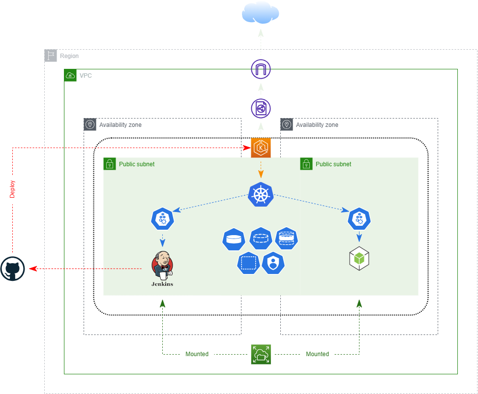

# Deploying Appliction on EKS cluster using Jenkins pipeline

The project aim to create an EKS cluster on AWS using Terraform and then deploy jenkins on cluster as a CI/CD pipeline to deploy applictions on cluster 


## Create EKS Cluster
Using terraform as IaC (Infrastraction as a Code) tool to create EKS cluster on AWS account \
Prerequisite need to be installed:
1. Terraform
2. AWS CLI
3. Kubectl

Terraform code has a multiples modules that used to build the cluster
### Modules:
#### 1. Network Module:
used to create VPC, Subnets and there resources that the cluster will use \
the module's inputs:
|Variable | Description |
|:--------|:------------|
|cidr |used to define ip range that will be used in network|
|availability-zones|used to define availability zones where resource will be built (depends on region) and define number of subnet will be create to achieve HA in cluster|

#### 2. Security Module: 
used to create security groups that will be used (note: that security group of EKS cluster will be created by default but you can define a custom one) in our cluster we will create security group just for storage \
the modules inputs:
|Variable | Description |
|:--------|:------------|
|cidr |used to define ip range that have acces to shared storage|
|vpc-id|the ID of VPC where the security group will be created|

#### 3. Storage Module: 
used to create  EFS (Elastic File System) to be used as a shared storage between nodes in EKS Cluster \
the module's inputs:
|Variable | Description |
|:--------|:------------|
|availability-zones|define availabilty zones where subnet that the storage will be mounted to|
|subnet-id|define subents that storage will be mouted to (list of subnets)|
|storage-sg-id|the security group for storage to define which node has access to storage|

#### 4. Roles Module:
define the  policies and roles that cluster and its nodes will use

#### 5. Cluster Module:
used to create EKS cluster and node group for that cluster \
the modules inputs:
|Variable | Description |
|:--------|:------------|
|cluster-name|the name of EKS cluster (should be unique in account domain)|
|eksClusterRole-arn|the role that EKS cluster will use|
|AmazonEKSNodeRole-arn|the role that EKS node group will use|
|public-subnets-id|the ID of subnets where the nodes will be created|
|ssh-key|the pair key that will be add to node ec2 instances that make it connectable using SSH|

#### Terrafoem main:
that is whee all modules will be combain with each other \
the main's inputs:
|Variable | Description |Default value |
|:--------|:------------|:-------------|
|region|the region where all resources will be creates o AWS account|"us-east-1"|
|cidr|used to define ip range that will be used in network|"10.0.0.0/16"|
|availability-zones|used to define availability zones where resource will be built (depends on region) and define number of subnet will be create to achieve HA in cluster|["us-east-1a", "us-east-1b"]|
|ssh-key|the pair key that will be add to node ec2 instances that make it connectable using SSH|<font color=red>Must Be Added |
|instance-type|the type of instace will be created as nodes for cluster|["t3.medium"]|
|cluster-name|the name of EKS cluster (should be unique in account domain)|"k8s-cluster"|

There is an eks.tf file, this file used to define null resources that will be used to connect to you cluster after it created and deploy an efs-csi driver as a daemonset on cluster to be used to connect to EFS shared storage on AWS

### Steps to deploy EKS cluster
After clone the github repo [infra repo](https://github.com/Ahmed-Elhgawy/aws-k8s-jenkins.git)
1. Add your AWS user credential using command `aws configure` and add user Access Key ID and Secret Access key
2. Now move terraform directory `cd terraform`
3. Initialize your terraform projct 
```
terraform init
```
4. Add ssh-key varaible and you have many ways to do that: \
    1. create a terraform.tfvars file and add the value of ssh-key
    ```
    ssh-key = "the-key-pair-name"
    ```
    2. add the variable while building the infarstracture
    ```
    terraform apply -auto-approve
    ```
    3. add the variable value in the command that start buiuding
    ```
    terraform apply -var ssh-key="the-kye-pair-name" -auto-approve
    ```

## Install Docker
In case using docker command in your pipeline you will need to install docker in cluster node

### Steps to install docker
After clone the github repo [infra repo](https://github.com/Ahmed-Elhgawy/aws-k8s-jenkins.git)
1. Move to ansible directory `cd ansible`
2. Get public ips of nodes in your cluster \
    **step to get public ips:** \
    a. Amazon EC2 console
    1. Open the Amazon [EC2 console](https://console.aws.amazon.com/ec2/)
    2. Choose Running instances
    3. In the Instance ID column, find your Amazon EC2 instance's instance ID
    4. In the same row as your instance ID, look at the IPv4 Public IP address column. The value listed is the Amazon EC2 instance's IP address

    b. Amazon EC2 console
    ```
    aws ec2 describe-instances --instance-ids <EC2_ID> --query 'Reservations[0].Instances[0].{"PublicIP":PublicIpAddress}'
    ```
3. Add the public ips to inventory file
```
[k8s_nodes]
node1-ip
node2-ip
...
```
4. Also add the path to your key pair in inventory file
```
[k8s_nodes:vars]
ansible_ssh_private_key_file = /path/to/your/key-pair
```
5. Run command to to install docker in all nodes using ansible
```
ansible-playbook site.yml
```

## Install jenkins to EKS Cluster
Using Helm Jenkins will be installed in EKS cluster as an one Appplication \
the jenkins/jenkins-master/values.yaml file contains all necessary values that helm needs in its templates to deploy Jnekins as one application
|Values |Description |
|:------|:-----------| 
|labels |Labels uses to define resources(pod, service, deployment)|
|depMetadata |Metadata for deployment(name)|
|replicas |Number of pods that the deployment will create|
|container |Information about container will be built inside pod (imageName, tag, imagePolicy)|
|resources |Resources will be used by pod(limits:max resources will be used(mem, cpu), request:resources will be reserved for pod(mem, cpu))|
|volumes |Volume that pod will use|
|svcMetadata |Metadata for service(name)|
|type |the type of service|
|httpPort|http port 80|
|uiPort|port fo ui 8080|
|slavePort| port that slave uses to conect to jenkins master 50000|
|namespace |namespace where all resources will be deployed|
|presistentVolume |Information about PV(name, reclaimPolicy, efs_id)|
|presistentVolumeClaim |Information about PVC(name, stoargeCapacity)|
|storageClass |Information about SC that mount between PV and PVC|
|clusterRole |Cluster Role Name that contain roles that jenkins will have|
|serviceAccount |The username or role that binding with clusterRole and jenkins will use in cluster|

### Deploy Jenkins on EKS Cluster
After build EKS Cluster on AWS account using Terraform
```
helm install jenkins-master jenkins/jenkins-master
```
And to check if installation doc=ne successfully
```
helm list
```
Now to connect to jenkins ui using browser
1. get the jenkins master pod name
    ```
    kubectl get pod -n jenkins
    ```
2. forward jenkins port port 
    ```
    kubectl port-forward -n jenkins <pod-name> 8080
    ```

### Now you Deploy Appliction on EKS cluster using Jenkins pipeline 😀😀

### [NodeJS](https://github.com/Ahmed-Elhgawy/NodeJsApp.git) is an application that can be used to test the pipeline
